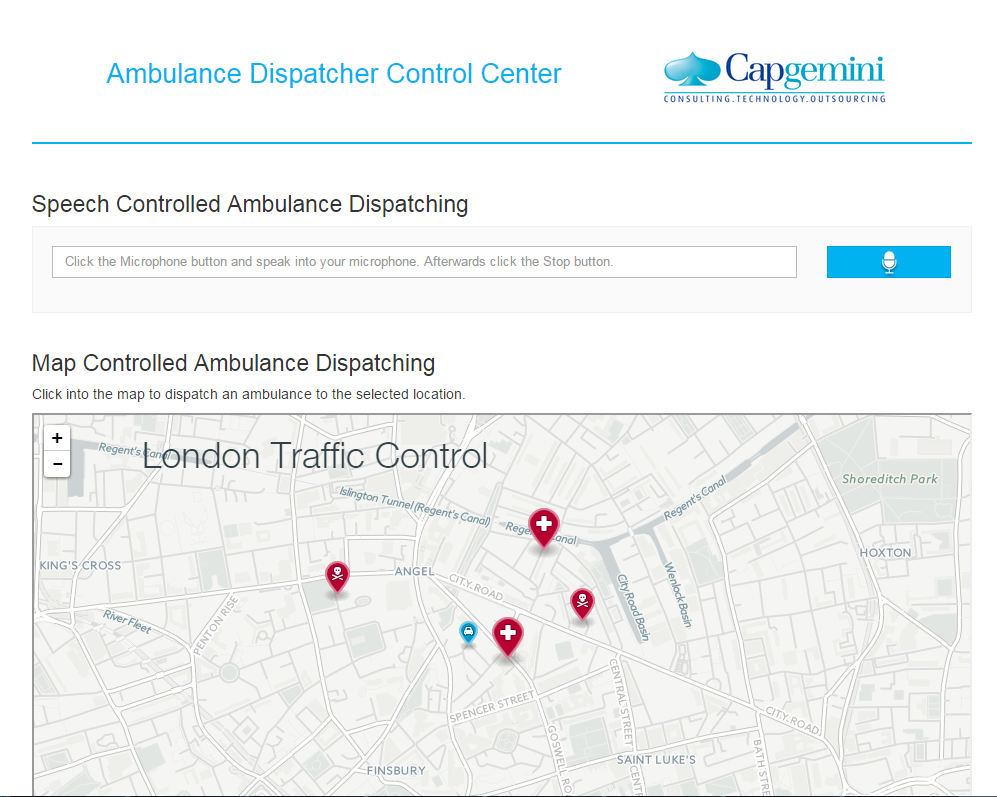
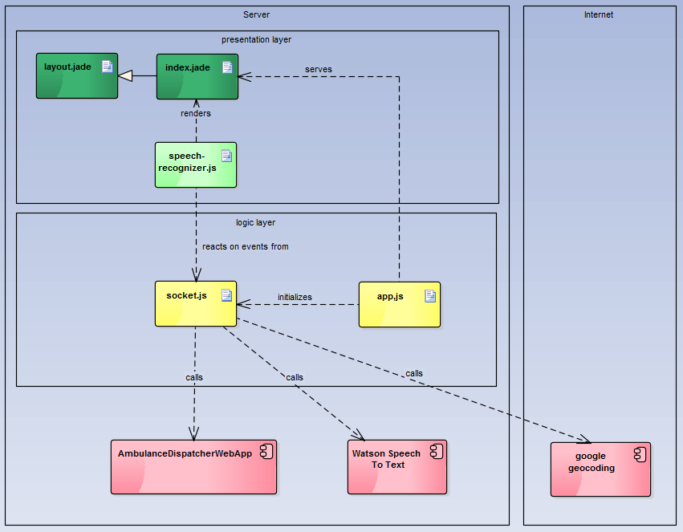

# AmbulanceDispatcherWebApp

The AmbulanceDispatcherWebApp is a Node.js based web application that uses [IBM Watson Speech to Text service](http://www.ibm.com/smarterplanet/us/en/ibmwatson/developercloud/speech-to-text.html) 
and google geocoding to alert ambulances by voice.

The application based on the [IBMs Watson Speech-To-Text demonstration application](https://speech-to-text-demo.mybluemix.net/) and is a stripped down version of [Andrew Trices medical QA application](https://dzone.com/articles/ibm-watson-qa-speech).

## AmbulanceDispatcherWebApp User Interface

The app is started in a web browser by using this URL: http://AmbulanceDispatcherWebApp.mybluemix.net/
*(or similar one, according your settings for the host)*

The **voice-input-bar** shows on the left side the last recognized words and the identified address (google geocoding) 
and on the right side the start-stop-button. The start-stop-button shows a microphone icon to start voice input
and a stop icon to stop the voice input. Stopping the voice input will send the identified address to the RouteWebApp.
(*Please use a good microphone, may be a head set and **not** the microphone of the laptop.)*

The **Map-frame** below shows the Website of the RouteWebApp in a frame. Here are the cars and the ambulances to be seen.



## Architecture

The applications architecture is that of a not layered Node.js server web application. 
Presentation rendering and user interaction is done in HTML files rendered and served by the application. 

The following diagram sketches the architecture showing its most important components.



## Components

The most important components of the application are as follows:

* ```*.jade``` - [JADE](http://jade-lang.com/) templates of the HTML pages rendered on the server, 
  the web based UI of the AmbulanceDispatcherApp
  * ```layout.jade``` - general definition of the page
  * ```index.jade``` - definition of voice-input-bar and the Map-frame. The include URL is defined here!
* ```app.js``` - main start class, starting and initializing the system and serving the single main 
  URL of the application
* ```socket.js``` - web socket based class communicating with Watson Speech to Text component, 
  google geoconding and accessing the RouteWebApp application 
  by its recording REST interface provide the GPS coordinates of the accident. 
* ```Watson Speech To Text```- service to translate spoken words to text
* ```RouteWebApp```- the application showing the cars, the ambulances and controls which ambulance 
  will send to the place of accident. The application is accessed by it's REST interface

##Run application in Bluemix
* Configure Application
  * choose runtime *Node.js*
  * add a service *Speech to Text*
* **fork this project - never commit to this branch!!!**
* check the configured application - this data is needed when you also want to run the application locally
  * **Environment Variable:** ```VCAP_SERVICES``` holds credentials to access the SpeechToText service 
* change the URL of teh RouteWebApp which provides the Map in file ```index.jade```:
  * ```iframe(src="http://routewebapp.mybluemix.net/" width="90%" height="400")```
* change the URL of the RouteWebApp you want to communicate in file ```socket.js```:
  * ```var routeWebAppCallURL = 'XXXXXXXXXXXX';```
* adjust the city for geocoding (if necessary) in file ```socket.js```:
  * ```var fixedGeocodingExtention = " Munich Germany";```
* change the host to your chosen value in file ```manifest.yml```:
  * ```host: AmbulanceDispatcherWebApp```

##Test application local
* install node framework locally (e.g. from https://nodejs.org/en/download/)
* Clone the projects locally
* import projects into IDE
* run "npm install" in project dir
* Lines, marked with "TODO AJUST TO YOUR ENVIRONMENT!", must changed to your local settings.
* run app.js as node application
